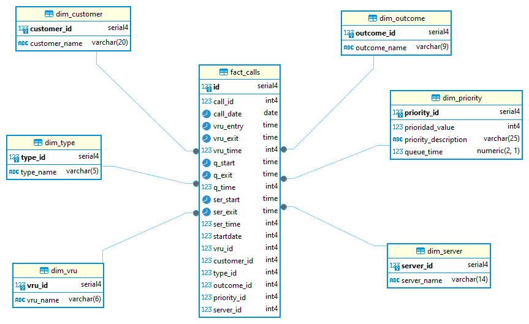

  <h1 align="center">
    Exploración y analisis de datos del Call Center Banco Casa Propia EAP:  
     
     
      
  </h1>

# Contenido 

* [Introducción](#Introducción)

* [Objetivos](#Objetivos)

* [Metodología](#Metodología)

* [El Dataset](#El-Dataset)

* [Modelo de Datos desde la base de datos PostgreSQL](#Modelo-de-Datos-desde-la-base-de-datos-PostgreSQL)

* [El Dashboard](#El-Dashboard)

* [Insights](#Insights)

# Introducción

En el entorno empresarial actual, la toma de decisiones estratégicas y oportunas es fundamental para el éxito. El análisis de datos juega un papel crucial en este proceso, proporcionando información valiosa y relevante que permite identificar tendencias, patrones y áreas de mejora. En el caso del sector financiero, la atención al cliente es un aspecto crítico para la satisfacción y fidelización de los usuarios. Los Call Centers, como puntos de contacto principales entre las instituciones financieras y sus clientes, generan una gran cantidad de datos que pueden ser utilizados para optimizar el servicio y la experiencia del cliente.

En este contexto, se presenta el análisis de datos y el desarrollo de un Dashboard en Power BI para un **Call Center del Banco Casa Propia**. Si bien esta entidad ya no se encuentra operativa, el dataset utilizado para este ejercicio tiene fines educativos y permite demostrar el poder de las herramientas de Business Intelligence (BI) para transformar datos en información accionable.

# Objetivos

El presente proyecto tiene como objetivos principales:

    * Analizar los datos del Call Center del Banco Casa Propia para identificar patrones, tendencias y áreas de mejora en la atención al cliente.
    * Desarrollar un Dashboard en Power BI que visualice de manera clara y concisa los indicadores clave de rendimiento (KPIs) relevantes para la evaluación del desempeño del Call Center.
    * Proporcionar información valiosa a la gerencia del Banco Casa Propia para la toma de decisiones estratégicas que optimicen el servicio del Call Center y mejoren la experiencia del cliente.

# Metodología

La metodología utilizada para el desarrollo del proyecto se compone de las siguientes etapas:

    * **Recolección y limpieza de datos**: Se recopilará el dataset del Call Center del Banco Casa Propia y se realizará una limpieza exhaustiva para eliminar registros inconsistentes o incompletos.
    * **Exploración y análisis de datos**: Se explorarán los datos desde una Base de Datos PostgreSQL creada para comprender su estructura, distribución y características principales. Se identificarán las variables relevantes para el análisis y se aplicarán técnicas estadísticas para descubrir patrones y tendencias.
    * **Selección de KPIs**: Se seleccionarán los KPIs más adecuados para evaluar el desempeño del Call Center, tomando en cuenta aspectos como la calidad del servicio, la eficiencia y la productividad.
    * **Desarrollo del Dashboard en Power BI**: Se utilizará la herramienta Power BI para crear un Dashboard interactivo que visualice los KPIs seleccionados. El Dashboard debe ser intuitivo y fácil de usar, permitiendo a los usuarios filtrar y segmentar la información según diferentes criterios.
    * **Comunicación de resultados**: Se presentarán los resultados del análisis y las visualizaciones del Dashboard a la gerencia del Banco Casa Propia. Se proporcionarán recomendaciones y estrategias para optimizar el servicio del Call Center y mejorar la experiencia del cliente.

# El Dataset

En el proyecto se cuenta con un conjunto de datos que bien puede asemejarce a los Call Center de hoy dia, estos fueron proporcionado unicamente para un estudios de analisis de datos y desarrollo de un Dashboard en Power BI, ellos iran sufriendo transformaciones hasta lograr el modelo de datos requerido. El Dataset consta de 444.448 filas y 18 columnas, una explicación de los atributos e información lo encontrara en el documento **Ejercicio Call Center - Descripción del DataSet.docx**

# Proceso de Extracción Transformación y Carga (ETL) 

El Dataset fue importado utilizando el manejador de base de datos **PostgreSQL** y desde allí se realizo la exploración y su analisis.

Se realizo la normalizacion, estandarización y limpieza de datos, llegando a la conclusion de 6 tablas categoricas o de dimensión que se explican a continaución :

**dim_customer** : Almacena la identificación que un cliente utiliza para usar los servicios del Call Center

**dim_outcome** : Almacena las acciones de **AGENT** cuando se dio el servicio, **HANG** si se cortó la llamada y no se dió servicio y **PHANTOM** cuando se ignora lo que sucedió.

**dim_priority** : Almacena las prioridad de 0, 1 y 2, siendo 2, un cliente de alta prioridad y 1 regular. Como la prioridad fue incorporada el 1ro de Agosto de 1996, existen aun clientes con prioridad 0 pero estos son tratados con priorida 1.

**dim_server** : Almacena el nombre del cliente que atendio la llamada, prestando en particular atencion a **NO_SERVER** que ocurre cuando el servicio no es suminstrado.

**dim_type** : Almacena los distintos servicios : 1. **PS** - Actividad Regular, 2. **PE** - Actividad Regular en inglés, 3. **IN** - Actividad / Consulta por internet, 4. **NE** - Actividad por Acciones (stock exchange), 5. **NW** - Cliente potencial (prospecto) solicitando información, 6. **TT** - clientes que dejan un mensaje pidiendo al banco que le devuelvan su llamado, el agente pasó a estado 'ocupado', dejando al cliente en espera en la cola.   

**dim_vru** : Almacena los 6 VRU existente con sus respectivas etiquetas enumeradas del 1 al 16 Cada llamada telefónica entrante es ruteada a través del VRU. Hay 6 VRUs etiquetados desde  AA01 a AA06. Cada VRU tiene varias líneas etiquetadas de 1 a 16. Hay un total de 65 líneas. Cada llamada es asignada a un número de VRU y a un número de línea.

**fact_calls** : Tabla de hechos que almacena los datos que describen a una llamada.

# Modelo de Datos desde la base de datos PostgreSQL

Luego de realizar las transformaciones necesarias obtuvimos el siguiente modelo de datos, los siguientes pasos se haran desde Power BI

  <h1 align="center">
    Modelo de Datos
     
     
      
  </h1>

Se observa las tablas categoricas o de dimensión, sus atributos y tipos de datos, con lo cual iremos  

# El Dashboard

Consta de una portada con los colores corporativo, logo, un objetivo y dos botones de navegación a las siguientes paginas 

### Dashboard 1 :
* Tiempo de espera en VRU
* Tiempo de espera en Cola
* Tiempo de espera en Servicio
* Total de Llamadas 
* Nieles de Servicio por Prioridad (0,1 y 2)
* Tipo de Outcome por Prioridad
**Importante** : Filtrado por Outcome

### Dahsboard 2 : 

[Haga clic aqui para obtener una copia del Dasboard](info/DashboardCasaPropia.pdf)

# Insights

<h4 align="center">
:construction: El Dasboard aun se encuentra en una etapa de analisis y construcción de graficas para generar los insights  :construction:
</h4>
